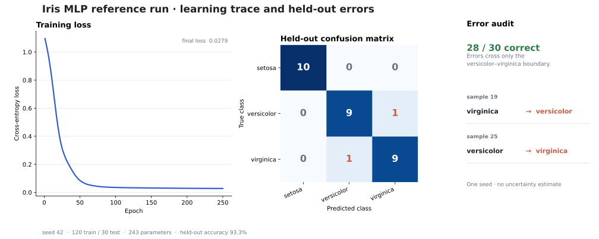

# PyTorch Fundamentals Lab

[](https://github.com/ethanvillalovoz/pytorch-fundamentals-lab/actions/workflows/ci.yml)
[](pyproject.toml)
[](LICENSE)

These notebooks are deliberately small. They start with tensor mechanics, end with a measured MLP and
CNN, and import their models and training loops from the same package that CI tests.

[](docs/media/iris-reference-evidence.pdf)

The error audit includes both committed mistakes—no held-out example was selected after viewing the results. [Figure contract and provenance](docs/figures/iris-reference/)

## What is here

| Lesson | Focus | Tested implementation |
| --- | --- | --- |
| `01_tensors` | Shape, dtype, device | Device selection and deterministic seeds |
| `02_tensor_operations` | Reshape, slice, broadcast, stack | Tensor semantics in focused examples |
| `03_autograd` | Loss, backward pass, optimizer step | Reusable supervised-learning loop |
| `04_iris_mlp` | Stratified split, train-only scaling, MLP | Deterministic reference experiment |
| `05_mnist_cnn` | Convolution, pooling, evaluation | Optional MNIST pipeline with bounded smoke runs |

The repository does not commit datasets, notebook output, or an unexplained checkpoint. MNIST uses
one ignored `data/` cache, and the Iris evidence is regenerated from source.

## Quick start

```bash
python -m venv .venv
source .venv/bin/activate
python -m pip install -e ".[notebooks,dev]"
make check
jupyter lab
```

Open the notebooks in order from [`notebooks/`](notebooks). For the package-only path, install the
base project with `python -m pip install -e .`.

## Reproduce the reference run

```bash
torch-lab iris --output-dir artifacts/iris-reference
git diff -- artifacts/iris-reference
```

The committed CPU run uses seed `42`, a stratified `120/30` split, train-only standardization, and a
243-parameter MLP. It correctly classifies `28/30` held-out examples (`93.3%`) with test loss
`0.1444`. The held-out set is intentionally small, so this is a reproducibility check, not a
benchmark claim.

- [`metrics.json`](artifacts/iris-reference/metrics.json) records configuration, learning curve,
  model size, loss, accuracy, and confusion matrix.
- [`predictions.csv`](artifacts/iris-reference/predictions.csv) makes every held-out decision
  inspectable.

## Run MNIST

Install the vision extra, then choose a bounded smoke run or a full experiment:

```bash
python -m pip install -e ".[vision]"

# Fast pipeline check
torch-lab mnist --epochs 1 --max-train-batches 100 --max-test-batches 20

# Full three-epoch run
torch-lab mnist --epochs 3
```

The CNN returns raw logits for `CrossEntropyLoss`. Training and evaluation aggregate loss and
accuracy by example, avoiding the misleading last-batch and batch-average calculations in the
original notebook implementation.

## Structure

```text
.
├── artifacts/iris-reference/  # reproducible metrics and predictions
├── docs/media/                # generated README preview
├── notebooks/                 # five output-free lessons
├── scripts/                   # notebook and media generators
├── src/pytorch_lab/           # models, experiments, CLI, and shared loops
└── tests/                     # deterministic unit and integration coverage
```

`scripts/build_notebooks.py` is the maintained source for notebook structure. CI regenerates the
notebooks and fails if committed files drift or acquire output.

## Verification

```bash
ruff check .
pytest
```

CI runs both commands on Python 3.10 and 3.12, enforces at least 90% package coverage, and verifies
that generated notebooks are current. See [CONTRIBUTING.md](CONTRIBUTING.md) for the short review
checklist.

## License

[MIT](LICENSE)
